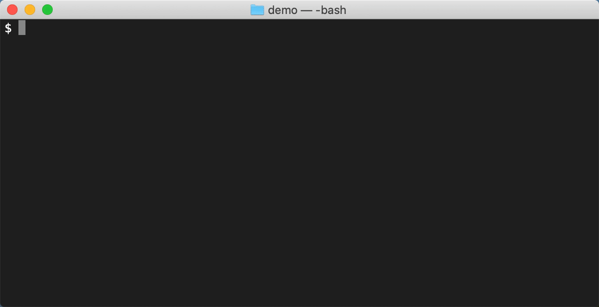

# bundleup

[](http://badge.fury.io/rb/bundleup)
[](https://app.circleci.com/pipelines/github/mattbrictson/bundleup?branch=main)

**Run `bundleup` on a Ruby project containing a Gemfile to see what gem dependencies need updating.** It is a friendlier command-line interface to [Bundler’s][bundler] `bundle update` and `bundle outdated`.

You might like bundleup because it:

- shows you exactly what gems will be updated lets you decide whether to proceed
- uses color to call your attention to important gem updates (based on [Semver][])
- lets you know when a version "pin" in your Gemfile is preventing an update
- relies on standard Bundler output and does not patch code or use Bundler internals

Here it is in action:



## Requirements

- Bundler 1.16 or later
- Ruby 2.5 or later

## Usage

Assuming you have a Ruby environment, all you need to do is install the bundleup gem:

```
gem install bundleup
```

Now, within a Ruby project you can run the bundleup command (the project needs to have a Gemfile and Gemfile.lock):

```
bundleup
```

That’s it!

Protip: Any extra command-line arguments will be passed along to `bundle update`. For example:

```
# Only upgrade development gems
bundleup --group=development
```

### Experimental: `--update-gemfile`

> 💡 This is an experimental feature that may be removed or changed in future versions.

Normally bundleup only makes changes to your Gemfile.lock. It honors the version restrictions ("pins") in your Gemfile and will not update your Gemfile.lock to have versions that are not allowed. However with the `--update-gemfile` flag, bundleup can update the version pins in your Gemfile as well. Consider the following Gemfile:

```ruby
gem 'sidekiq', '~> 5.2'
gem 'rubocop', '0.89.0'
```

Normally running `bundleup` will report that these gems are pinned and therefore cannot be updated to the latest versions. However, if you pass the `--update-gemfile` option like this:

```
$ bundleup --update-gemfile
```

Now bundleup will automatically edit your Gemfile pins as needed to bring those gems up to date. For example, bundleup would change the Gemfile to look like this:

```ruby
gem 'sidekiq', '~> 6.1'
gem 'rubocop', '0.90.0'
```

Note that `--update-gemfile` will _not_ modify Gemfile entries that contain a comment, like this:

```ruby
gem 'sidekiq', '~> 5.2' # our monkey patch doesn't work on 6.0+
```

## How bundleup works

bundleup starts by making a backup copy of your Gemfile.lock. Next it runs `bundle check` (and `bundle install` if any gems are missing in your local environment), `bundle list`, then `bundle update` and `bundle list` again to find what gems versions are being used before and after Bundler does its updating magic. (Since gems are actually being installed into your Ruby environment during these steps, the process may take a few moments to complete, especially if gems with native extensions need to be compiled.)

Finally, bundleup runs `bundle outdated` to see the gems that were _not_ updated due to Gemfile restrictions.

After displaying its findings, bundleup gives you the option of keeping the changes. If you answer "no", bundleup will restore your original Gemfile.lock from its backup, leaving your project untouched.

## Roadmap

bundleup is very simple at this point, but it could be more. Some possibilities:

- Automatically commit the Gemfile.lock changes with a nice commit message
- Integrate with bundler-audit to mark upgrades that have important security fixes
- Display relevant CHANGELOG entries for major upgrades
- Non-interactive mode

If you have other ideas, open an issue on GitHub!

## Contributing

Code contributions are also welcome! Read [CONTRIBUTING.md](CONTRIBUTING.md) to get started.

[bundler]: http://bundler.io
[semver]: http://semver.org
